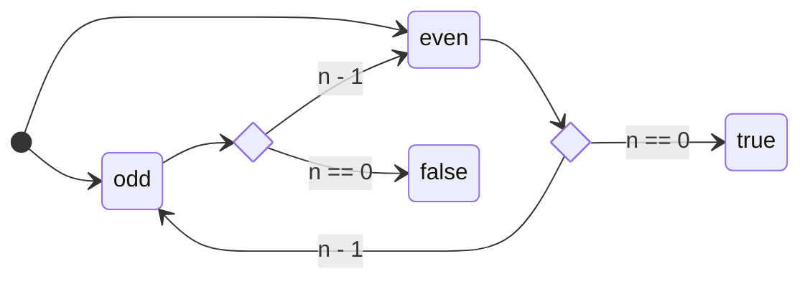

# Control over evaluation

Using `Eval` you can control evaluation of a value or a computation that produces a value.
This is useful to delay potentially costly computations, and to prevent start
overflows by carefully choosing when computations should take place.

:::note Where to find it

Control over evaluation lives in the `arrow-eval` library.

:::

You construct `Eval` instance by providing a function that computes a value, together with an _evaluation strategy_.
There are three basic strategies:
- `Eval.now` evaluates the function immediately.
- `Eval.later` waits until the first time the value is requested. Once computed, the result is saved, so subsequent calls return immediately.
- `Eval.always` evaluates the function every time we need its value. If you ask for the value more than once, the function is executed again.

We say that `Now` is an _eager_ evaluation strategy, and `Later` and `Always` are _lazy_ evaluation strategies.

One of the main use cases for `Eval` is **stack safety**, that is, preventing stack overflows for operations with deep recursion.
For example, here is a (overly complicated) way to compute whether a number is even or odd, by jumping between `even` and `odd` until we reach `0`.



This approach would lead to stack overflow for big numbers, but we can prevent this using `Eval`. Using `Eval.always { n == 0}` we indicate that we want the evaluation to be performed when we need the answer; using `later` or `always` does not make a big difference here, since we only evaluate once per `n` in any case. We indicate the next operation by using `flatMap`.
```kotlin
import arrow.core.Eval

fun even(n: Int): Eval<Boolean> =
  Eval.always { n == 0 }.flatMap {
    if(it == true) Eval.now(true)
    else odd(n - 1)
  }

fun odd(n: Int): Eval<Boolean> =
  Eval.always { n == 0 }.flatMap {
    if(it == true) Eval.now(false)
    else even(n - 1)
  }

fun main() {
  println(odd(100000).value())
}
```

One difference between `Eval` and [`DeepRecursiveFunction`](../recursive/) is that with `Eval` we can call functions directly instead of using `callRecursive`. However, the latter is more performant in general, so we advise using it unless you require the additional control provided by `Eval`.

:::warning Use the provided API

You should _not_ use `when` with `Eval` instances. Rather, use `map` and `flatMap` to chain computations and `value` to get the result when needed.

You should _not_ create `Eval` instances that call `value` on other `Eval` instances. This defeats the barriers in place against stack overflows.

:::
