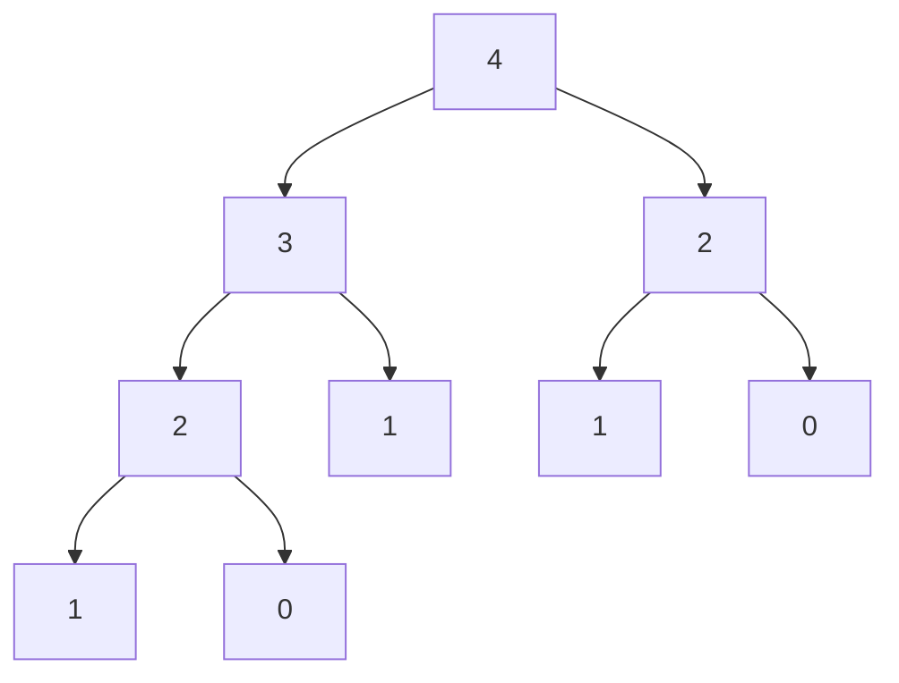

# Recursive functions

Algorithms with a functional flavor tend to favor recursion over looping.
This is often hidden in higher-level functions like `map` and `filter`,
so you don't often see it on your code. However, when the time comes, some
platforms (including the JVM) can make your life quite difficult: deep
recursion means a deep stack, so you can easily get a `StackOverflowError`,
even for not-so-big values.

<!--- TEST_NAME RecursiveFunctionsTest -->

<!--- INCLUDE .*
import io.kotest.matchers.shouldBe
-->

## Stack-safe deep recursive functions

Kotlin comes with a built-in [`DeepRecursiveFunction`](https://kotlinlang.org/api/latest/jvm/stdlib/kotlin/-deep-recursive-function/)
which solves this problem by keeping the call stack in the heap, which usually
has a much bigger memory space allocated to it.

The [Fibonacci sequence](https://en.wikipedia.org/wiki/Fibonacci_sequence) is
an all-time favorite example of a recursive operation which requires a deep stack
even for small values. The function is only defined for non-negative `n`,
so we split the actual worker function from the top-level one, which checks the
constraint over the argument.

```kotlin
fun fibonacciWorker(n: Int): Int = when (n) {
  0 -> 0
  1 -> 1
  else -> fibonacciWorker(n - 1) + fibonacciWorker(n - 2)
}

fun fibonacci(n: Int): Int {
  require(n >= 0)
  return fibonacciWorker(n)
}

fun example() {
  fibonacci(6) shouldBe 8
}
```
<!--- KNIT example-recursive-01.kt -->
<!--- TEST assert -->

To make this function stack-safe we move the worker from being a regular
function into being a `DeepRecursiveFunction`. The latter takes a block which
defines the function, very similar to a regular one. The key change is that
instead of calling `fibonacciWorker`, we use `callRecursive` every time we
need recursion.

<!--- INCLUDE
fun fibonacci(n: Int): Int {
  require(n >= 0)
  return fibonacciWorker(n)
}

fun example() {
  fibonacci(6) shouldBe 8
}
-->

```kotlin
val fibonacciWorker = DeepRecursiveFunction<Int, Int> { n ->
  when (n) {
    0 -> 0
    1 -> 1
    else -> callRecursive(n - 1) + callRecursive(n - 2)
  }
}
```
<!--- KNIT example-recursive-02.kt -->
<!--- TEST assert -->

:::caution Function in a val

Note that we've used `val` to save the `DeepRecursiveFunction`, instead of
`fun`. However, since that type overloads the `invoke` operator, we still
can call it as if it was a function, so no changes are required for `fibonacci`.

:::

## Memoization

There's an enormous amount of duplicate work being done in a call to `fibonacci`.
Here is the call tree of `fibonacciWorker(4)`, you can see that we end up in
`fibonacci(2)` a couple of times. Not only that: we can see that in the recursive
call for `n - 1` we eventually require the value for `n - 2` too. Could we make
this function a bit less wasteful?



:::info Fibonacci 🤯

The number of calls required to compute Fibonacci is also given by the Fibonacci
sequence!

:::

Fibonacci is a pure function, in other words, given the same argument we always
obtain the same result. This means that once we've computed a value, we can just
_record_ in some cache, so later invocations only have to look there. This
technique is known as **memoization**, and Arrow provides an implementation
in the form of [`MemoizedDeepRecursiveFunction`](https://apidocs.arrow-kt.io/arrow-core/arrow.core/-memoized-deep-recursive-function.html).
No changes other than the outer call are required.

```kotlin
import arrow.core.MemoizedDeepRecursiveFunction

val fibonacciWorker = MemoizedDeepRecursiveFunction<Int, Int> { n ->
  when (n) {
    0 -> 0
    1 -> 1
    else -> callRecursive(n - 1) + callRecursive(n - 2)
  }
}
```
<!--- INCLUDE
fun fibonacci(n: Int): Int {
  require(n >= 0)
  return fibonacciWorker(n)
}

fun example() {
  fibonacci(6) shouldBe 8
}
-->
<!--- KNIT example-recursive-03.kt -->
<!--- TEST assert -->

:::caution Memoization takes memory

If you define the memoized version of your function as a `val`, as we've done
above, the cache is shared among **all** calls to your function. In the worst
case, this may result in memory which cannot be reclaimed throughout the whole
execution, so you should apply this technique carefully.

There's some literature about [eviction policies for memoization](https://otee.dev/2021/08/18/cache-replacement-policy.html),
but at the moment of writing memoize doesn't offer any type of control over the
cached values. [Aedile](https://github.com/sksamuel/aedile) is a Kotlin-first
caching library which you can use to manually tweak your memoization.

:::
