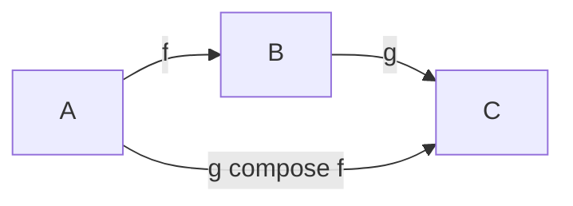
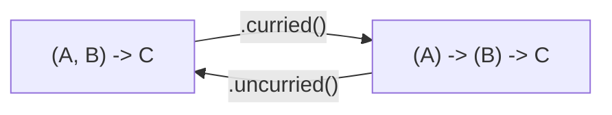

# Working with functions

Functions are an important part of functional programming. Every time we use
`map` or `filter` we are using functions as arguments, every block is creating
a new anonymous function. Arrow brings some patterns which have proven useful
in other programming language communities when manipulating functions as values.

<!--- TEST_NAME FunctionsUtilsTest -->

:::info Point-free style

The utilities described in this section are part of a particular style of
programming called _point-free_. The name stems from the fact that you never
mention explicit arguments, or _points_, in your code.
Some functional programming communities, like Haskell, use this style quite
often.

:::

## Composition

Composition is used to create a pipeline of functions, in which each of them
consume the result of the previous one. In particular, given two functions
`f(a: A): B` and `g(b: B): C`, the result of `g compose f` is a new function
of type `(a: A) -> C` which executes `f` over `a`, and then `g` over the result.
In graphical form it looks as follows:



:::caution Order of composition

When writing a composition pipeline `f compose g compose h`, remember that
computations are applied in **right-to-left** order; in this case we begin
with `h` and finish with `f`. This mirrors the way you would write them
using explicit invocations, `{ f(g(h(it))) }`.

:::

## Partial application

Imagine you have a two-argument function, like this very useful one in a disco,

```kotlin
fun dance(rounds: Int, person: String): Unit { TODO() }
```

and you want to apply it over a list, where everybody dances the same number of
rounds,

```kotlin
fun List<String>.everybodyDancesTwo() = forEach { dance(2, it) }
```
<!--- KNIT example-function-utils-01.kt -->

The block given to `forEach` is an example of a **partially-applied** function,
that is, an instance in which some arguments of the functions are fixed
(in this case the `rounds`), and others are yet to be given. Instead of an
explicit invocation with `it`, you can use `partially1` from Arrow to inject
those fixed arguments, as follows.

```kotlin
import arrow.core.partially1

fun List<String>.everybodyDancesTwo() = forEach(::dance.partially1(2))
```

<!--- INCLUDE
fun dance(rounds: Int, person: String): Unit { TODO() }
-->

<!--- KNIT example-function-utils-02.kt -->

Arrow provides `partiallyN` functions up to a reasonable value of `N`,
depending on the amount of values you inject.

:::caution Order of partial application

The functions provided by Arrow always start fixing arguments from the left,
that is, from the "first" parameter in the signature. At the moment of writing
there are no versions of partial application for functions with a receiver.

:::

## Currying

Functions in Kotlin take all arguments in one go; writing something like
`dance(2)` is not allowed, hence the need of partial application above.
But for every function we can always define a variation which takes arguments
_one at a time_. This process is called **currying**, and Arrow provides
conversion back and forth. The types of the functions make this process quite
explicit: we go from `(A, B) -> C` (two arguments at once) to `(A) -> (B) -> C`
(after giving one argument, we have a function which expects the other one).


