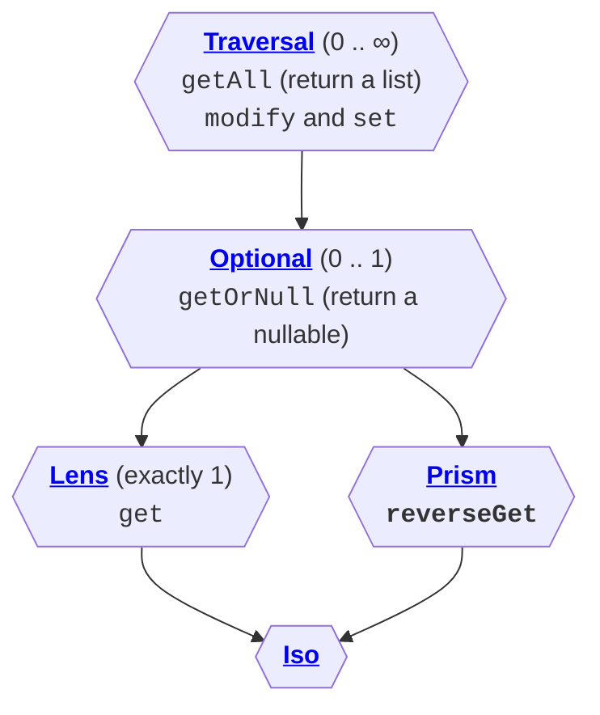

# Introduction

<!--- TEST_NAME ImmutableIntro -->

Data classes, sealed hierarchies, and above all, **immutable data** is
an excellent recipe for [domain modeling](../../design/domain-modeling/). If we want
to model a domain sharply, we often end up with a large amount of (nested)
classes, each of them representing a particular kind of object.

```kotlin
data class Person(val name: String, val age: Int, val address: Address)
data class Address(val street: Street, val city: City)
data class Street(val name: String, val number: Int?)
data class City(val name: String, val country: String)
```

Alas, Kotlin doesn't provide great tooling out of the box to transform those
values. Data classes have a built-in `copy` method, but we need to repeat the
name of the fields and perform iterated copies even if we only want to touch
one single field.

```kotlin
fun Person.capitalizeCountry(): Person =
  this.copy(
    address = address.copy(
      city = address.city.copy(
        country = address.city.country.capitalize()
      )
    )
  )
```
<!--- KNIT example-immutable-intro-01.kt -->

:::note

We often use the word _transform_ even though we are talking about immutable
data. In most cases, we refer to creating a _copy_ of the value where some of
the fields are _modified_.

:::

## Meet optics

Arrow provides a solution to this problem in the form of **optics**. Optics
are values that represent access to a value (or values) inside a larger
value. For example, we may have an optic focusing (that's the term we use)
on the `address` field of a `Person`. By combining different optics, we can
concentrate on nested elements, like the `city` field within the `address` field
within a `Person`. But code speaks louder than words, so let's see how the
example above improves using optics.

The easiest way to start with Arrow Optics is through its compiler
plug-in. After [adding it to your build](../../quickstart/#additional-setup-for-plug-ins)
you just need to mark each class for which you want optics generated
with the `@optics` annotation.

```kotlin
import arrow.optics.*

@optics data class Person(val name: String, val age: Int, val address: Address) {
  companion object
}
@optics data class Address(val street: Street, val city: City) {
  companion object
}
@optics data class Street(val name: String, val number: Int?) {
  companion object
}
@optics data class City(val name: String, val country: String) {
  companion object
}
```

:::caution Annoying companion object

You need to have a `companion object` declaration in each class, even if it's empty.
This is due to limitations in [KSP](https://kotlinlang.org/docs/ksp-quickstart.html),
the compiler plug-in framework used to implement the Arrow Optics plug-in.

:::

The plug-in generates optics for each field, available under the class name.
For example, `Person.address` is the optic focusing on the `address` field.
Furthermore, you can create optics that focus on nested fields using the
same dot notation you're used to. In this case,
`Person.address.city.country` represents the optic focusing precisely on
the field we want to transform. By using it, we can reimplement `capitalizeCountry`
in two ways:

1. **Optic-first**: the `modify` operation of an optic takes an entire value
  (`this` in the example) and the transformation to apply to the focused element.

    ```kotlin
    fun Person.capitalizeCountryModify(): Person =
      Person.address.city.country.modify(this) { it.capitalize() }
    ```

2. **Copy builder**: Arrow Optics provides an overload of `copy` that, instead
   of named arguments, takes a block. Inside that block, you can use the syntax
   `optic transform operation` to modify a focused element.

    ```kotlin
    fun Person.capitalizeCountryCopy(): Person =
      this.copy {
        Person.address.city.country transform { it.capitalize() }
      }
    ```

<!--- KNIT example-immutable-intro-02.kt -->

## Many optics to rule them all

You may have noticed that we speak about optic*s*. In fact, there are a few
important kinds that differ in the *amount* of elements they
can potentially focus on. All the optics in the example above are **lenses**,
which have precisely one focus. At the other end of the spectrum, we have
[**traversals**](../traversal), which focus on any amount of elements; they can be used to 
uniformly modify all the elements in a list, among other operations.
Optics form a hierarchy that we can summarize in the diagram below.

<center>



</center>

The "main line" of optics is `Traversal` → `Optional` → `Lens`, which differ
only in the number of elements they focus on. [`Prism` and `Iso`](../prism-iso) add a slight 
twist: they allow not only modifying, but also _creating_ new values and
matching over them.

:::info Even more optics

Arrow 1.x features a larger hierarchy of optics because the operations of
"getting" values and "modifying" them live in different interfaces.
Arrow 2.x simplifies the hierarchy to the five optics described in this section.

```mermaid
graph TD;
  subgraph <h4>only access</h4>
    fold{{"<b>Fold</b> (0 .. ∞)<br /><tt>getAll</tt>"}};
    optionalFold{{"<b>OptionalFold</b> (0 .. 1)<br /><tt>getOrNull</tt>"}};
    getter{{"<b>Getter</b> (exactly 1)<br /><tt>get</tt>"}};
  end
  setter{{"<b>Setter</b><br /><tt>modify</tt> and <tt>set</tt>"}};
  subgraph <h4>Arrow 2.x</h4>
    traversal{{"<b>Traversal</b>"}};
    optional{{"<b>Optional</b>"}};
    lens{{"<b>Lens</b>"}};
    prism{{"<b>Prism<b><br /><tt>reverseGet</tt>"}};
    iso{{"<b>Iso<b>"}}
  end
  fold-->traversal;
  setter-->traversal;
  fold-->optionalFold;
  optionalFold-->getter;
  optionalFold-->optional;
  traversal-->optional;
  getter-->lens;
  optional-->lens;
  optional-->prism;
  lens-->iso;
  prism-->iso;
```

:::
