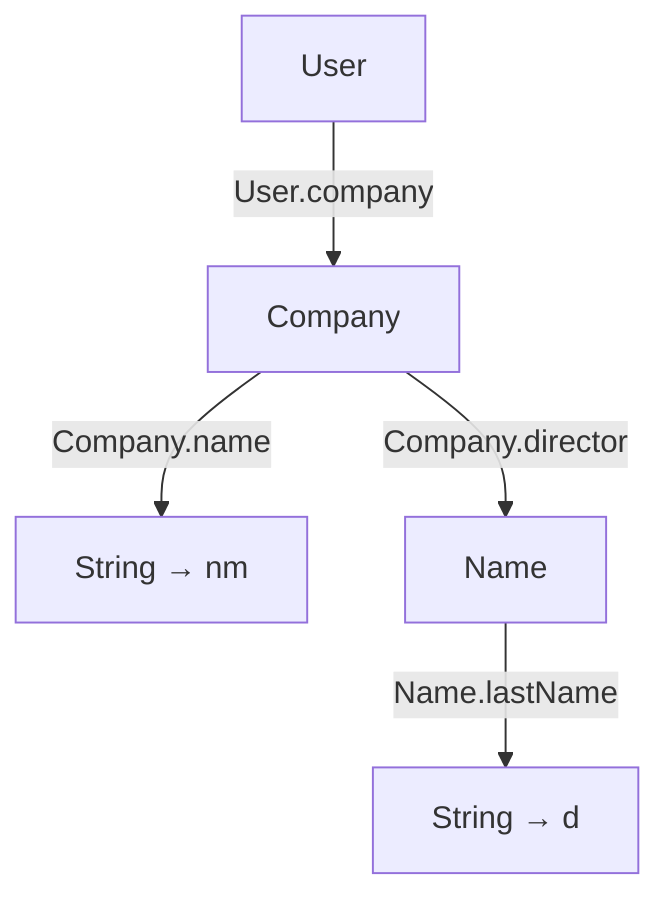

# (Pattern) matching

[Optionals](optional.md) and [prisms](prism-iso.md) provide ways to query
whether a certain piece of data is present, and [lenses](lens.md) allow
us to extract some information from a value. In many functional languages,
those tasks are accomplished using [pattern matching](https://en.wikipedia.org/wiki/Pattern_matching);
and with Arrow Optics those same ideas translate to Kotlin.

<!--- TEST_NAME Matching -->

<!--- INCLUDE
import arrow.optics.*
import arrow.optics.match.*
-->

In the rest of this document we use this set of types, which showcase a 
sealed hierarchy (`User`/`Person`/`Company`) for which prisms are generated,
and data classes for which we get lenses.

```kotlin
@optics data class Name(
  val firstName: String, val lastName: String
) { companion object }

@optics sealed interface User { companion object }
@optics data class Person(
  val name: Name, val age: Int
): User { companion object }
@optics data class Company(
  val name: String, val director: Name, val address: String
): User { companion object }
```

Here is the implementation of a small function that returns how to show 
the name of a `User`. We use pattern matching to extract the information;
in particular, we pattern match on `this`, as hinted by the `this.matchOrThrow`
heading the code.

```kotlin
val User.name: String get() = this.matchOrThrow {
  // Company(name = nm, director = Name(lastName = d))
  User.company(Company.name, Company.director(Name.lastName)) then { (nm, d) -> "$nm, att. $d" }
  // Person(Name(firstName = fn), age if it < 18)
  User.person(Person.name(Name.firstName), Person.age.takeIf { it < 18 }) then { (fn, _) -> fn }
  // Person(Name(firstName = fn, lastName = ln))
  User.person(Person.name(Name.firstName, Name.lastName)) then { (fn, ln) -> "Sir/Madam $fn $ln" }
}
```

Let us unpack the block right after `this.matchOrThrow`, which defines three
potential _cases_. Each case is made up of two elements separated by `then`:

1. The _pattern_ describes a shape of data that the value should be
   matched against;
2. The _body_ describes the code to execute if the match is successful.
   In that body, you have access to pieces of the data from the pattern.

One way to describe a pattern is using a diagram, where each node represents a value of a type,
and each edge represents a lens or prism to be applied to a value. The diagram corresponding
to our first case looks as follows.



As you can see, you can match more than one field inside a value by joining different optics
inside parentheses. This is what we do above with the name of the company, and the last name
of the director. After digging into the value, you always reach some _terminal_ values,
which are represented in the diagram as nodes with no children. Those terminal values are the
ones available as arguments to the body of the case; above we show the corresponding variable
names in the body.

The pattern matching mechanism in `arrow-optics` also allow you to add checks about values
at any point in the pattern. In our example above, the `age` is checked to decide whether to
apply the first match, using `.takeIf { it < 18 }`.

:::tip It

If you do not need to perform an initial check with a prism, as we do above, you use
`it` at the start of the pattern. For example, `it(Person.name(Person.firstName))` would
match on a `Person` and obtain its first name.

:::

## Default cases

The example at the beginning of this section is _exhaustive_, that is, matches every possible
value of type `User`. This may not always be the case; using `matchOrThrow` over a value which
is not handled by any pattern results in a `MatchNotFound` exception.

If you want to define how to handle any remaining case, you use use the special `default` pattern.
For example, here we gather information about the director if available, and return `null` otherwise.

```kotlin
fun User.directorOrNull(): Name? = this.matchOrThrow {
  User.company(Company.director) then { it }
  default { null }
}
```
<!--- KNIT example-matching-01.kt -->

:::warning Exhaustiveness checking

It is responsibility of the developer to ensure that the patterns cover every possible case,
adding `default` whenever required.

The Kotlin compiler ensures that every `when` with a subject is ehxaustive using a specialized
analysis. Unfortunately, such an analysis is not performed over the patterns described in
this section.

:::

## Matching without optics

You can also use pattern matching without bringing the full optics machinery in, by using
the reflection facilities provided by the Kotlin language alongisde the `arrow-match` package.

:::tip Type-safe reflection

Even though the term _reflection_ usually evokes unsafety, the API provided by `arrow-match` 
guarantees that patterns that compile are well-behaved.

:::

Since we do not have optics, we need another way to represent types and property:

- Instead of prisms, the type is chosen using `T::class`;
- Instead of lenses, properties are described using `T::property`.
- Further matching on a value is done using `.of`.

You can see those changes in action in the "translation" of the first example in this section
to `arrow-match`.

<!--- INCLUDE
import arrow.match.*

data class Name(
  val firstName: String, val lastName: String
)

sealed interface User
data class Person(
  val name: Name, val age: Int
): User
data class Company(
  val name: String, val director: Name, val address: String
): User
-->

```kotlin
val User.name: String get() = this.matchOrThrow {
  // Company(name = nm, director = Name(lastName = d))
  Company::class.of(Company::name, Company::director.of(Name::lastName)) then { (nm, d) -> "$nm, att. $d" }
  // Person(Name(firstName = fn), age if it < 18)
  Person::class.of(Person::name.of(Name::firstName), Person::age.takeIf { it < 18 }) then { (fn, _) -> fn }
  // Person(Name(firstName = fn, lastName = ln))
  Person::class.of(Person::name.of(Name::firstName, Name::lastName)) then { (fn, ln) -> "Sir/Madam $fn $ln" }
}
```
<!--- KNIT example-matching-02.kt -->

## Matching with guards

We strongly discourage using Arrow's pattern matching facilities for simple cases.
In most cases patterns can be recreated using `when` expressions with guards and
property access, leading to more idiomatic code. This approach has the additional
benefit of the exhaustiveness checking performed by the compiler.

```
val User.name: String get() = when (this) {
  is Company -> "$name, att ${director.lastName}"
  is Person if age < 18 -> name.firstName
  is Person -> "Sir/Madam ${name.firstName} ${name.lastName}"
}
```

Here are some rules of thumb to decide when pattern matching is a good solution:

- The decision over which branch to takes depends on nested information.
  This is the case, for example, when working with abstract syntax trees (ASTs).
- One needs to obtain several sub-values. For example, `User.name` defined without
  pattern matching forces us to write `name.firstName` and `name.lastName`, whereas
  this duplication is gone when using a pattern.

As you can see, the more nested your data it, the more pattern matching helps.
