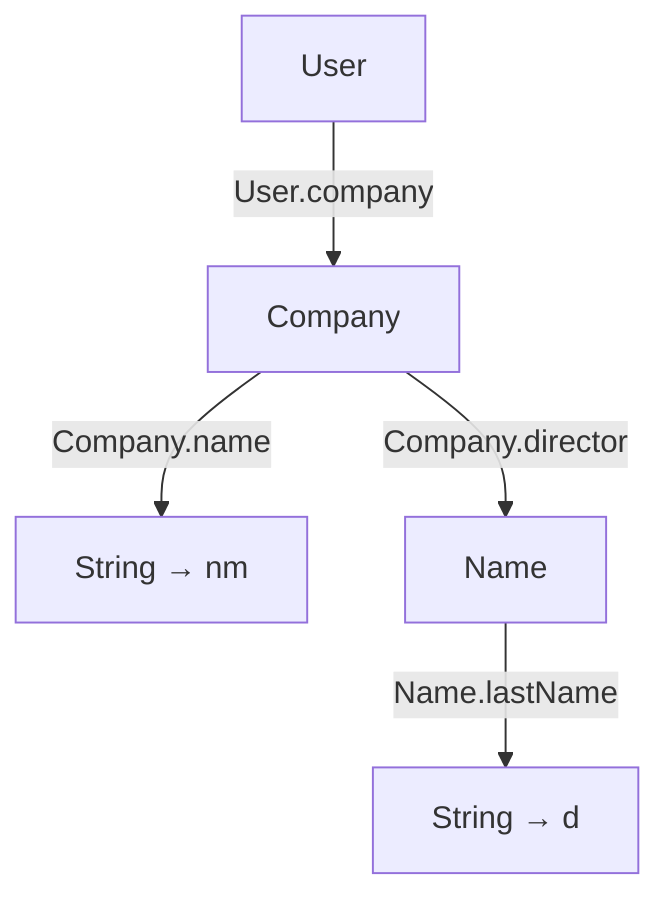

# (Pattern) matching

[Optionals](optional.md) and [prisms](prism-iso.md) provide ways to query
whether a certain piece of data is present, and [lenses](lens.md) allow
us to extract some information from a value. In many functional languages,
those tasks are accomplished using [pattern matching](https://en.wikipedia.org/wiki/Pattern_matching);
and with Arrow Optics those same ideas translate to Kotlin.

<!--- TEST_NAME Matching -->

<!--- INCLUDE .*
import io.kotest.matchers.shouldBe
import arrow.optics.*
import arrow.optics.match.*
-->

In the rest of this document we use this set of types, which showcase a 
sealed hierarchy (`User`/`Person`/`Company`) for which prisms are generated,
and data classes for which we get lenses.

```kotlin
@optics data class Name(
  val firstName: String, val lastName: String
) { companion object }

@optics sealed interface User { companion object }
@optics data class Person(
  val name: Name, val age: Int
): User { companion object }
@optics data class Company(
  val name: String, val director: Name, val address: String
): User 
```

Here is the implementation of a small function that returns how to show 
the name of a `User`. We use pattern matching to extract the information;
in particular, we pattern match on `this`, as hinted by the `this.matchOrThrow`
heading the code.

```kotlin
val User.name: String get() = this.matchOrThrow {
  // Company(name = nm, director = Name(lastName = d))
  User.company(Company.name, Company.director(Name.lastName)) then { (nm, d) -> "$nm, att. $d" }
  // Person(Name(firstName = fn), age if it < 18)
  User.person(Person.name(Name.firstName), Person.age.suchThat { it < 18 }) then { (fn, _) -> fn }
  // Person(Name(firstName = fn, lastName = ln)) -> "Sir/Madam $fn $ln"
  User.person(Person.name(Name.firstName, Name.lastName)) then { (fn, ln) -> "Sir/Madam $fn $ln" }
}
```

Let us unpack the block right after `this.matchOrThrow`, which defines three
potential _cases_. Each case is made up of two elements separated by `then`:

1. The _pattern_ describes a shape of data that the value should be
   matched against;
2. The _body_ describes the code to execute if the match is successful.
   In that body, you have access to pieces of the data from the pattern.

One way to describe a pattern is using a diagram, where each node represents a value of a type,
and each edge represents a lens or prism to be applied to a value. The diagram corresponding
to our first case looks as follows.



As you can see, you can match more than one field inside a value by joining different optics
inside parentheses. This is what we do above with the name of the company, and the last name
of the director. After digging into the value, you always reach some _terminal_ values,
which are represented in the diagram as nodes with no children. Those terminal values are the
ones available as arguments to the body of the case; above we show the corresponding variable
names in the body.

The pattern matching mechanism in `arrow-match` allows you to add checks about values
at any point in the pattern. In our example above, the `age` is checked to decide whether to
apply the first match, using `.suchThat { it < 18 }`.

:::tip It

If you do not need to perform an initial check with a prism, as we do above, you use
`it` at the start of the pattern. For example, `it(Person.name(Person.firstName))` would
match on a `Person` and obtain its first name.

:::

## Default cases


