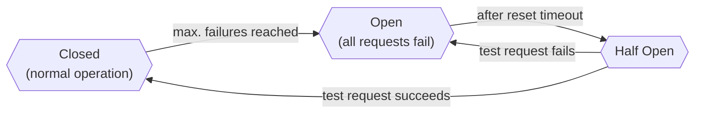

# Circuit breaker

import Admonition from '@theme/Admonition';

<!--- TEST_NAME CircuitBreaker -->

When a service is overloaded, additional interaction may only worsen its
overloaded state. This is especially true when combined with retry mechanisms such as [`Schedule`](../retry-and-repeat/).
Sometimes, simply using a back-off retry policy might not be sufficient 
during peak traffic. To prevent such overloaded resources from overloading, 
a **circuit breaker** protects the service by failing fast. This helps us 
achieve stability and prevents cascading failures in distributed systems.

## Circuit breaker protocol

A circuit breaker is named after a similar concept in electrical engineering.
It may be in one of three states.



<Admonition type="note" icon="🔀" title="Closed">

- This is the state in which the circuit breaker starts.
- Requests are made normally in this state:
  - When an exception occurs, it increments the failure counter.
    - When the failure counter reaches the given `maxFailures` threshold, 
      the breaker moves to the _Open_ state.
  - A successful request will reset the failure counter to zero.

</Admonition>

<Admonition type="note" icon="⏹️" title="Open">

- In this state, the circuit breaker short-circuits/fails-fast all requests.
  - This is done by throwing the `ExecutionRejected` exception.
- If a request is made after the configured `resetTimeout`, 
  the breaker moves to the _Half Open_ state,
  allowing one request to go through as a test.

</Admonition>

<Admonition type="note" icon="⤴️" title="Half Open">

- The circuit breaker is in this state while allowing a request to go through as a _test request_.
  - All other requests made while test request` is still running short-circuit/fail-fast.
- If the test request succeeds, the circuit breaker is tripped back into _Closed_,
  with the `resetTimeout` and the `failures` count also reset to initial values.
- If the test request fails, the circuit breaker moves back to _Open_, 
  and the `resetTimeout` is multiplied by the `exponentialBackoffFactor` 
  up to the configured `maxResetTimeout`.

</Admonition>

:::info Additional context for this pattern

[Circuit Breaker pattern](https://learn.microsoft.com/en-us/azure/architecture/patterns/circuit-breaker)
in _Cloud Design Patterns_.

:::

## Opening strategies

Arrow offers different strategies to determine when the circuit breaker should open and short-circuit all incoming requests. The currently available ones are:

- [_Count_](https://apidocs.arrow-kt.io/arrow-resilience/arrow.resilience/-circuit-breaker/-opening-strategy/-count/index.html).
  This strategy sets a maximum number of failures. Once this threshold is reached, the circuit breaker moves to _Open_. 
  Note that every time a request succeeds, the counter is set back to zero; the circuit breaker only
  moves to _Open_ when the maximum number of failures happen **consecutively**.
- [_Sliding Window_](https://apidocs.arrow-kt.io/arrow-resilience/arrow.resilience/-circuit-breaker/-opening-strategy/-sliding-window/index.html).
  This strategy counts the number of failures within a given time window. Unlike the `Count` approach, the circuit breaker
  will only move to `Open` if the number of failing requests tracked within the given period exceeds the threshold. As the
  time window slides, the failures out of the window limits are ignored.

## Arrow's [`CircuitBreaker`](https://apidocs.arrow-kt.io/arrow-resilience/arrow.resilience/-circuit-breaker/index.html)

Let's create a circuit breaker that only allows us to call a remote service twice.
After that, whenever more than two requests fail with an exception, 
the circuit breaker starts short-circuiting/failing-fast.

A new instance of `CircuitBreaker` is created using [`of`](https://apidocs.arrow-kt.io/arrow-resilience/arrow.resilience/-circuit-breaker/-companion/of.html); there, we specify
the different options. 

:::caution Deprecation in Arrow 1.2

The `of` constructor function has been deprecated in favor of exposing the `CircuitBreaker` constructor.

:::

Then we wrap every call to the service that may
potentially fail with [`protectOrThrow`](https://apidocs.arrow-kt.io/arrow-resilience/arrow.resilience/-circuit-breaker/protect-or-throw.html) or [`protectEither`](https://apidocs.arrow-kt.io/arrow-resilience/arrow.resilience/-circuit-breaker/protect-either.html), depending on how we
want this error to be communicated back. If the error arises, the internal state
of the circuit breaker also changes.

<!--- INCLUDE
import arrow.core.Either
import arrow.resilience.CircuitBreaker
import arrow.resilience.CircuitBreaker.OpeningStrategy
import kotlin.time.Duration.Companion.seconds
import kotlin.time.ExperimentalTime
import kotlinx.coroutines.delay
-->
```kotlin
@ExperimentalTime
suspend fun main(): Unit {
  val circuitBreaker = CircuitBreaker(
    openingStrategy = OpeningStrategy.Count(2),
    resetTimeout = 2.seconds,
    exponentialBackoffFactor = 1.2,
    maxResetTimeout = 60.seconds,
  )

  // normal operation
  circuitBreaker.protectOrThrow { "I am in Closed: ${circuitBreaker.state()}" }.also(::println)

  // simulate service getting overloaded
  Either.catch { 
    circuitBreaker.protectOrThrow { throw RuntimeException("Service overloaded") }
  }.also(::println)
  Either.catch {
    circuitBreaker.protectOrThrow { throw RuntimeException("Service overloaded") }
  }.also(::println)
  circuitBreaker.protectEither { }
   .also { println("I am Open and short-circuit with ${it}. ${circuitBreaker.state()}") }

  // simulate reset timeout
  println("Service recovering . . .").also { delay(2000) }

  // simulate test request success
  circuitBreaker.protectOrThrow { 
    "I am running test-request in HalfOpen: ${circuitBreaker.state()}" 
  }.also(::println)
  println("I am back to normal state closed ${circuitBreaker.state()}")
}
```
<!--- KNIT example-circuitbreaker-01.kt -->

A common pattern to make resilient systems is to compose a circuit breaker with 
a backing-off policy that prevents the resource from overloading. `Schedule` is insufficient to make your system resilient because you 
also have to consider parallel calls to your functions.
In contrast, a circuit breaker track failures of every function call or 
even different functions to the same resource or service.

<!--- INCLUDE
import arrow.core.Either
import arrow.resilience.CircuitBreaker
import arrow.resilience.CircuitBreaker.OpeningStrategy
import arrow.resilience.Schedule
import arrow.resilience.retry
import kotlin.time.Duration.Companion.seconds
import kotlin.time.ExperimentalTime
import kotlinx.coroutines.delay
-->
```kotlin
@ExperimentalTime
suspend fun main(): Unit {
  suspend fun apiCall(): Unit {
    println("apiCall . . .")
    throw RuntimeException("Overloaded service")
  }

  val circuitBreaker = CircuitBreaker(
    openingStrategy = OpeningStrategy.Count(2),
    resetTimeout = 2.seconds,
    exponentialBackoffFactor = 1.2,
    maxResetTimeout = 60.seconds,
  )

  suspend fun <A> resilient(schedule: Schedule<Throwable, *>, f: suspend () -> A): A =
    schedule.retry { circuitBreaker.protectOrThrow(f) }

  // simulate getting overloaded
  Either.catch {
    resilient(Schedule.recurs(5), ::apiCall)
  }.let { println("recurs(5) apiCall twice and 4x short-circuit result from CircuitBreaker: $it") }

  // simulate reset timeout
  delay(2000)
  println("CircuitBreaker ready to half-open")

  // retry once,
  // and when the CircuitBreaker opens after 2 failures
  //    retry with exponential back-off with same time as CircuitBreaker's resetTimeout
  val fiveTimesWithBackOff = Schedule.recurs<Throwable>(1) andThen
    Schedule.exponential(2.seconds) and Schedule.recurs(5)

  Either.catch {
    resilient(fiveTimesWithBackOff, ::apiCall)
  }.let { println("exponential(2.seconds) and recurs(5) always retries with actual apiCall: $it") }
}
```
<!--- KNIT example-circuitbreaker-02.kt -->
