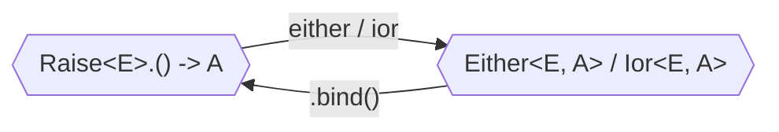

# Either & Ior

<!--- TEST_NAME EitherIorKnitTest -->

<!--- INCLUDE .*
import io.kotest.matchers.shouldBe
import arrow.core.left
import arrow.core.right
import arrow.core.Either
-->

Both [`Either<E, A>`](https://apidocs.arrow-kt.io/arrow-core/arrow.core/-either/index.html)
and [`Ior<E, A>`](https://apidocs.arrow-kt.io/arrow-core/arrow.core/-ior/index.html)
hold values that may be of type `E` or `A`.
By convention, the type `E` represents _errors_ and the type `A` represents
_success_. For example, `Either<DbError, User>` could be a good result type for
a function that accesses a database and returns a `User` but may also fail
with a `DbError`. Another point of view is that both types _extend_ the capabilities
of the built-in [`Result`](https://kotlinlang.org/api/latest/jvm/stdlib/kotlin/-result/) 
type, but no longer constraining the potential errors to be `Throwable`.

`Either<E, A>` only admits these two possibilities: a `Left` holding a value of
type `E` or a `Right` holding a value of type `A`. On the other hand, `Ior<E, A>`
provides a third option, namely `Both`. Using `Both`, you can represent states 
that are considered successful but with some potential errors during execution;
like a compiler that finishes successfully but has some warnings. Nevertheless,
`Ior` is not used very often.

## Using builders

The preferred way to work with `Either` and `Ior` is to use [builders](../../typed-errors/).
Those start with a call to `either` or `ior` followed by a lambda; inside that
block, we can access the uniform typed errors API with functions like `raise`,
`ensure`, and `recover`.

```kotlin
import arrow.core.raise.either
import arrow.core.raise.ensure

data class MyError(val message: String)

fun isPositive(i: Int): Either<MyError, Int> = either {
  ensure(i > 0) { MyError("$i is not positive") }
  i
}

suspend fun example() {
  isPositive(-1) shouldBe MyError("-1 is not positive").left()
  isPositive(1)  shouldBe 1.right()
}
```
<!--- KNIT example-either-ior-01.kt -->
<!--- TEST assert -->

To give you the complete picture, inside those blocks, the potential errors are
represented by a receiver of type `Raise<E>`. Functions with that receiver can
be transformed into a variety of types; not only `Either` and `Ior`, but also
`Result`, `Option`, or a nullable type.

A common scenario is to have an `Either` or `Ior` value that we want to execute
as part of the block. That is, we want potential errors in those values to bubble
as errors of the entire block or keep the execution if the value represents
success. In those cases, we need to call `.bind()` over the value of type `Either`
or `Ior`.



:::tip

We recommend using the [custom `NoEffectScopeBindableValueAsStatement` rule](https://github.com/woltapp/arrow-detekt-rules#noeffectscopebindablevalueasstatement)
for [Detekt](https://detekt.dev/) to prevent forgetting `.bind()` inside
an `either` or `ior` block.

:::

### Combining Ior errors

The flow in an `Either` block is simple: we execute each step; if at some point
we `bind()` a `Left` or find a `raise`, we stop and return that value; if we get
to the end, we wrap the result in `Right`. `ior` blocks are a bit more complicated,
since we may end up in a situation in which we have errors to be reported, yet
we also have a value to continue the execution. This brings up a question: what
should we do if _several_ steps in the block are `Both`? The current API leaves
the answer open to the developer. The `ior` builder has
an additional parameter that specifies how to combine several errors.

## Without builders

In some scenarios, builders may be overkill for the task at hand. For those cases,
we provide functions that create or operate directly on `Either` and `Ior`.

On the generation front, extension functions like `.left()` and `.right()`
provide another way to write expressions that won't obscure the inner contents
as much as a constructor. Validations are often written in that style.

```kotlin
// this is the type we want to construct
@JvmInline value class Age(val age: Int)

// these are the potential problems
sealed interface AgeProblem {
  object InvalidAge: AgeProblem
  object NotLegalAdult: AgeProblem
}

// validation returns either problems or the constructed value
fun validAdult(age: Int): Either<AgeProblem, Age> = when {
  age < 0  -> AgeProblem.InvalidAge.left()
  age < 18 -> AgeProblem.NotLegalAdult.left()
  else     -> Age(age).right()
}
```
<!--- KNIT example-either-ior-02.kt -->

Another way to obtain an `Either` is using `Either.catch`, which wraps a
computation that may throw exceptions and returns a `Left` if that's the case.
Essentially, [`runCatching` from the standard library](https://kotlinlang.org/api/latest/jvm/stdlib/kotlin/run-catching.html),
but replacing `Result` with `Either`.

The rest of the API closely follows the one from [typed errors](../../typed-errors/).
For example, you can call `recover` or `zipOrAccumulate` directly on `Either`
without the need for an additional `either { }` block. One potentially useful
function not part of builders is [`mapLeft`](https://apidocs.arrow-kt.io/arrow-core/arrow.core/-either/map-left.html), 
which applies a function when the value represents an error. This scenario often
arises when your code has a hierarchy of different error types.

## Either for validation

`Either` has a double face: it can be used to model problems in a piece of code,
pretty much like exceptions, but also to define validations over some input data.
The difference between these two scenarios is how we react to _several_ problems
arising in a piece of code.

- When we think of exceptions, we have a _fail-fast_ or _fail-first_ approach:
  Once we discover a problem, we want to stop execution and immediately report
  to the caller. In those scenarios, steps _depend_ on one another, so it makes
  no sense to keep trying.
- When we think of validation, we want to be as comprehensive as possible with
  potential problems with the input data. In other words, if the given name
    and age are wrong, we want to report both, not just the first one.
  This approach is called _accumulation_ and arises when the code is computations
  whose failure is _independent_ of each other.

By default, an `either` block follows the first approach. If you want to accumulate
errors instead, you should use [`zipOrAccumulate`](https://apidocs.arrow-kt.io/arrow-core/arrow.core/-either/-companion/zip-or-accumulate.html),
or [`mapOrAccumulate`](https://apidocs.arrow-kt.io/arrow-core/arrow.core/map-or-accumulate.html).
The difference is that the former takes the different computations as arguments,
and they can return different types, whereas the latter applies the same computation
uniformly to elements of an `Iterable`.

One common pattern when describing validations is to have an `Either` with
`List<Problem>` as the error type. Arrow provides a more refined version
where we ensure that we never end up in an awkward situation in which we have
a `Left` value, but the list of problems is empty.

```kotlin
public typealias EitherNel<E, A> = Either<NonEmptyList<E>, A>
```

In Arrow 1.x series, a different type called `Validation` embodied
the accumulation strategy for errors. However, the API was almost identical, and
sometimes code became flooded with conversion back and forth between `Either` and `Validation`.
Arrow 2.x provides a single `Either` type instead, but we encourage you to use
the `EitherNel` type alias if you are describing a validation.
