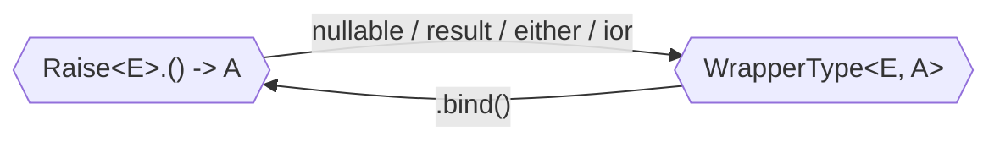

# Working with typed errors

<!--- TEST_NAME TypedErrorsTest -->

_Typed errors_ refer to a technique from functional programming in which we
make _explicit_ in the signature (or _type_) the potential errors that may
arise during the execution of a piece of code. This is not the case when using
exceptions, which any documentation is not taken into account by the compiler,
leading to a defensive mode of error handling.

:::info Media resources

- [_Functional Error Handling - A Practical Approach_](https://kotlindevday.com/videos/functional-error-handling-a-practical-approach-bas-de-groot/) by Bas de Groot
- [_Exception handling in Kotlin with Arrow_](https://www.youtube.com/watch?v=ipF540mBG9w) by Ramandeep Kaur
- [_Por qué no uso excepciones en mi código_](https://www.youtube.com/watch?v=8WdprhzmQe4) by Raúl Raja and [Codely](https://codely.com/)
- [_Typed error handling in Kotlin_](https://medium.com/@mitchellyuwono/typed-error-handling-in-kotlin-11ff25882880) by Mitchell Yuwono

:::

## Concepts and types

In the rest of the documentation we often refer to a few concepts related to error handling.

:::note Logical Failure vs. Real exceptions

We use the term _logical failure_ to describe a situation not deemed as successful in your domain, but that it's still within the realms of that domain.
For example, if you are implementing a repository for users, not finding a user for a certain query is a logical failure.

In contrast to logical failures we have _real exceptions_, which are problems, usually technical, which are _truly exceptional_ and are thus not part of our domain.
For example, if the connection to the database suddenly drops, or network times out, host unavailable, etcetera.
Those cases benefit from the [resilience mechanisms](../../resilience/) provided by Arrow.

:::

:::note Success and failure

When talking about error handling, we often distinguish between _success_ or _happy path_, and _failure_.
The former represents the case in which everything works as intended, whereas the latter represents a problem.
Depending on the approach, the signature of the function only signals that a failure is possible,
or additionally describes the range of problems that may arise.

:::

There are two main approaches to representing types in the signature of a function.
Fortunately, Arrow provides a _uniform_ API to working with all of them, which is described in the rest of this section.

The first approach is using a _wrapper type_, in which the return type of your function
is nested within a larger type that provides the choice of error. 
In that way the error is represented as a _value_.
For example, the following signature expresses that the outcome of `findUser` is 
of type `User` when successful, or `UserNotFound` when a logical failure is raised.

```
fun findUser(id: UserId): Either<UserNotFound, User>
```

The Kotlin standard library includes a few wrapper types, but they are all restricted in the information they may include.
Arrow introduces `Either` and `Ior`, both giving the developer the choice of type of logical failures, and reflecting that choice
as their first type parameter.

| Type | Failure | Simultaneous <br /> success and failure? | Kotlin stdlib. or Arrow? |
|---|---------|------|---|
| `A?` | `null` | No |  |
| `Option<A>` | `None` | No |  |
| `Result<A>` | `Failure` contains a `Throwable`, <br /> inspection possible at runtime | No |  |
| `Either<E, A>` | `Left` contains value of type `E` | No |  |
| `Ior<E, A>` | `Left` contains value of type `E` | Yes, using `Both` |  |


The second approach is describing errors as part of the _computation context_ of the function.
In that case the ability to finish with logical failures is represented by having `Raise<E>`
be part of the context or scope of the function. Kotlin offers two choices here: we can use
an extension receiver or using the more modern context receivers.

```
// Raise<UserNotFound> is extension receiver
fun Raise<UserNotFound>.findUser(id: UserId): User
// Raise<UserNotFound> is context receiver
context(Raise<UserNotFound>) fun findUser(id: UserId): User
```

Let's define a simple program that _raises_ a _logical failure_ of `UserNotFound` or returns a `User`. We can represent this both as a value `Either<UserNotFound, User>`, and as a _computation_ (using `Raise<UserNotFound>`).

:::caution Two examples per code block

In the examples in this document we use `Either<E, A>` as wrapper type and
`Raise<E>` as extension receiver, with the intention of the reader choosing
their preferred type. Note that the same ideas and techniques apply to the
rest of choices outlined above.

:::

## Defining the success / happy path

The code below shows how we define a function which _successfully_ returns a `User`.

<!--- INCLUDE
import arrow.core.Either
import arrow.core.Either.Left
import arrow.core.Either.Right
import arrow.core.right
import arrow.core.raise.Raise
import arrow.core.raise.either
import arrow.core.raise.fold
import io.kotest.assertions.fail
import io.kotest.matchers.shouldBe
-->
```kotlin
object UserNotFound
data class User(val id: Long)

val user: Either<UserNotFound, User> = User(1).right()

fun Raise<UserNotFound>.user(): User = User(1)
```
<!--- KNIT example-typed-errors-01.kt -->

In the case of `Either`, since we are creating a _value_ (note the use of `val`) we need to additionally wrap our value in the type that represents success.
This type is called `Right`, although it's common to use the `.right()` extension function to give more predominance to the value itself.
In the case of a _computation_ (note the use of `fun`) with `Raise` the value is returned directly.

## Raising an error

To create a _value_ of a _logical failure_, we use the `left` _smart-constructor_ for `Either`, or `raise` DSL function for a _logical failure_ inside a `Raise` _computation_.

<!--- INCLUDE
import arrow.core.Either
import arrow.core.Either.Left
import arrow.core.Either.Right
import arrow.core.left
import arrow.core.raise.Raise
import arrow.core.raise.fold
import io.kotest.assertions.fail
import io.kotest.matchers.shouldBe

object UserNotFound
data class User(val id: Long)
-->
```kotlin
val error: Either<UserNotFound, User> = UserNotFound.left()

fun Raise<UserNotFound>.error(): User = raise(UserNotFound)
```
<!--- KNIT example-typed-errors-02.kt -->

Besides `raise` or `left`, several DSLs are also available to check invariants.
`either { }` and `Raise` offer `ensure` and `ensureNotNull`, in spirit with `require` and `requireNotNull` from the Kotlin Std.
Instead of throwing an exception, they result in a _logical failure_ with the given error if the predicate is not satisfied.

`ensure` takes a _predicate_ and a _lazy_ `UserNotFound` value. When the _predicate_ is not matched, the _computation_ will result in a _logical failure_ of `UserNotFound`.
In the function below, we show how we can use `ensure` to check if a given `User` has a valid id, and if not, we return a _logical failure_ of `UserNotFound`.

<!--- INCLUDE
import arrow.core.Either
import arrow.core.left
import arrow.core.raise.ensure
import arrow.core.raise.either
import arrow.core.raise.Raise
import arrow.core.raise.fold
import io.kotest.assertions.fail
import io.kotest.matchers.shouldBe

data class User(val id: Long)
-->

```kotlin
data class UserNotFound(val message: String)

fun User.isValid(): Either<UserNotFound, Unit> = either {
  ensure(id > 0) { UserNotFound("User without a valid id: $id") }
}

fun Raise<UserNotFound>.isValid(user: User): User {
  ensure(user.id > 0) { UserNotFound("User without a valid id: ${user.id}") }
  return user
}

fun example() {
  User(-1).isValid() shouldBe UserNotFound("User without a valid id: -1").left()

  fold(
    { isValid(User(1)) },
    { _: UserNotFound -> fail("No logical failure occurred!") },
    { user: User -> user.id shouldBe 1 }
  )
}
```
<!--- KNIT example-typed-errors-03.kt -->
<!--- TEST assert -->

Without context receivers, these functions look pretty different depending on if we use `Raise` or `Either`. This is because we sacrifice our _extension receiver_ for `Raise`.
And thus, the `Raise` based computation cannot be an extension function on `User`. With context receivers, we could've defined it as:

<!--- INCLUDE
import arrow.core.raise.Raise
import arrow.core.raise.ensure

data class User(val id: Long)
data class UserNotFound(val message: String)
-->
```kotlin
context(Raise<UserNotFound>)
fun User.isValid(): Unit =
  ensure(id > 0) { UserNotFound("User without a valid id: $id") }
```
<!--- KNIT example-typed-errors-04.kt -->

`ensureNotNull` takes a _nullable value_ and a _lazy_ `UserNotFound` value. When the value is null, the _computation_ will result in a _logical failure_ of `UserNotFound`.
Otherwise, the value will be _smart-casted_ to non-null, and you can operate on it without checking nullability.
In the function below, we show how we can use `ensureNotNull` to check if a given `User` is non-null, and if not, we return a _logical failure_ of `UserNotFound`.

<!--- INCLUDE
import arrow.core.Either
import arrow.core.left
import arrow.core.raise.ensureNotNull
import arrow.core.raise.either
import arrow.core.raise.Raise
import arrow.core.raise.fold
import io.kotest.assertions.fail
import io.kotest.matchers.shouldBe

data class User(val id: Long)
data class UserNotFound(val message: String)
-->
```kotlin
fun process(user: User?): Either<UserNotFound, Long> = either {
  ensureNotNull(user) { UserNotFound("Cannot process null user") }
  user.id // smart-casted to non-null
}

fun Raise<UserNotFound>.process(user: User?): Long {
  ensureNotNull(user) { UserNotFound("Cannot process null user") }
  return user.id // smart-casted to non-null
}

fun example() {
  process(null) shouldBe UserNotFound("Cannot process null user").left()

  fold(
    { process(User(1)) },
    { _: UserNotFound -> fail("No logical failure occurred!") },
    { i: Long -> i shouldBe 1L }
  )
}
```
<!--- KNIT example-typed-errors-05.kt -->
<!--- TEST assert -->

## Running and inspecting results

We _inspect_ the value of `res` using Kotlin's `when`, or `fold` the _computation_ providing a lambda for both the _logical failure_ and the _success_ case.

<!--- INCLUDE
import arrow.core.Either
import arrow.core.Either.Left
import arrow.core.Either.Right
import arrow.core.left
import arrow.core.raise.Raise
import arrow.core.raise.fold
import io.kotest.assertions.fail
import io.kotest.matchers.shouldBe

object UserNotFound
data class User(val id: Long)

val error: Either<UserNotFound, User> = UserNotFound.left()

fun Raise<UserNotFound>.error(): User = raise(UserNotFound)
-->
```kotlin
fun example() {
  when (error) {
    is Left -> error.value shouldBe UserNotFound
    is Right -> fail("A logical failure occurred!")
  }

  fold(
    block = { error() },
    recover = { e: UserNotFound -> e shouldBe UserNotFound },
    transform = { _: User -> fail("A logical failure occurred!") }
  )
}
```
<!--- KNIT example-typed-errors-06.kt -->
<!--- TEST assert -->

:::info Fold over all possible cases
Unless you explicitly wrap your code to catch exceptions as part of `Either` or `Raise`, exceptions bubble up in the usual way. If you need to handle those exceptions, `fold` is also available with a `catch` argument to recover from any `Throwable` that might've been thrown. [More information can be found below](#from-exceptions).
:::

Another possibility is to have a `Raise` computation, that we would like to turn into a wrapper type.
In that case we don't have to call `fold`, we can use one of the runners, each of them named as the wrapper type, but with all letters in lowercase.

<!--- INCLUDE
import arrow.core.Either
import arrow.core.Either.Left
import arrow.core.Either.Right
import arrow.core.left
import arrow.core.raise.Raise
import arrow.core.raise.fold
import arrow.core.raise.either
import io.kotest.assertions.fail
import io.kotest.matchers.shouldBe

object UserNotFound
data class User(val id: Long)

val error: Either<UserNotFound, User> = UserNotFound.left()

fun Raise<UserNotFound>.error(): User = raise(UserNotFound)
-->

```kotlin
fun example() {
  either { error() } shouldBe UserNotFound.left()
}
```
<!--- KNIT example-typed-errors-07.kt -->
<!--- TEST assert -->

<!--- INCLUDE
import arrow.core.Either
import arrow.core.Either.Left
import arrow.core.Either.Right
import arrow.core.right
import arrow.core.raise.Raise
import arrow.core.raise.either
import arrow.core.raise.fold
import io.kotest.assertions.fail
import io.kotest.matchers.shouldBe

object UserNotFound
data class User(val id: Long)

val user: Either<UserNotFound, User> = User(1).right()

fun Raise<UserNotFound>.user(): User = User(1)
-->

The converse direction, turning a value of a type like `Either` into a
computation with `Raise`, is achieved via the `.bind()` extension function.

```kotlin
fun Raise<UserNotFound>.res(): User = user.bind()
```
<!--- KNIT example-typed-errors-08.kt -->

In fact, to define a result with a wrapper type, we recommend to use one
of the runners (`either`, `ior`, et cetera), and use `.bind()` to "inject"
any sub-computation that may be required, or `raise` to describe a logical
failure. We often refer to this approach as _using the `Raise` DSL_.

<!--- INCLUDE
import arrow.core.Either
import arrow.core.Either.Left
import arrow.core.Either.Right
import arrow.core.right
import arrow.core.raise.Raise
import arrow.core.raise.either
import arrow.core.raise.fold
import io.kotest.assertions.fail
import io.kotest.matchers.shouldBe

object Problem
-->

```kotlin
val maybeTwo: Either<Problem, Int> = either { 2 }
val maybeFive: Either<Problem, Int> = either { raise(Problem) }

val maybeSeven: Either<Problem, Int> = either {
  maybeTwo.bind() + maybeFive.bind()
}
```
<!--- KNIT example-typed-errors-09.kt -->



:::info Don't forget your binds!

The [Arrow Detekt Rules](https://github.com/woltapp/arrow-detekt-rules) project has a set of rules to _detekt_ you call `bind` on every `Either` value.

:::

:::info Nested error types

Sometimes you may need to have one error type inside another one, 
like `Either<Problem, Int?>`. The rule of thumb in that case is to nest the
runner functions (`either`, `option`, `nullable`) in the same order as they
appear in the type. When you call `raise`, the type of the error given as
argument is used to "select" the appropriate type to fall back to.

<!--- INCLUDE
import arrow.core.Either
import arrow.core.raise.either
import arrow.core.raise.nullable

object Problem
-->

```kotlin
fun problematic(n: Int): Either<Problem, Int?> =
  either { 
    nullable { 
      when {
        n < 0  -> raise(Problem)
        n == 0 -> raise(null)
        else   -> n
      }
    }
  }
```
<!--- KNIT example-typed-errors-10.kt -->

:::

## Recovering from typed errors

We've already hinted this distinction above, but with working with type errors it's important to distinguish between two kinds of _problems_ that may arise:

- _Logical failures_ indicate problems within the domain, and which should be handled as part of the usual domain logic. For example, trying to find a user which doesn't exist, or validating input data.
- _Exceptions_ indicate problems which affect the system's ability to continue working. For example, if the database connection breaks this is something outside your domain logic.

Historically exceptions have been used for both cases. For example, throwing a `UserNotValidException` when the input data was wrong.
We advocate for making this distinction clear in the types, and leave exceptions only for exceptional cases.
However, we're also aware of the historical baggage, so we provide tools to transforms those exceptions which shouldn't have been exceptions into typed errors.

### From logical failures

When working with values or functions that can result in a typed error, we often need to _recover_ to provide or calculate fallback values.
To demonstrate how we can _recover_ from _logical failures_, let's define a simple function that returns our `User` in case the `id > 0`; otherwise it returns `UserNotFound`.

<!--- INCLUDE
import arrow.core.Either
import arrow.core.left
import arrow.core.getOrElse
import arrow.core.raise.ensure
import arrow.core.raise.either
import arrow.core.raise.Raise
import arrow.core.raise.recover
import io.kotest.assertions.fail
import io.kotest.matchers.shouldBe

data class User(val id: Long)
data class UserNotFound(val message: String)
-->
```kotlin
suspend fun fetchUser(id: Long): Either<UserNotFound, User> = either {
  ensure(id > 0) { UserNotFound("Invalid id: $id") }
  User(id)
}

suspend fun Raise<UserNotFound>.fetchUser(id: Long): User {
  ensure(id > 0) { UserNotFound("Invalid id: $id") }
  return User(id)
}
```

To recover from any errors on a `Either` value, we can most conveniently use `getOrElse`, since it allows us to _unwrap_ the `Either` and provide a fallback value.
The same can be done for the `Raise` based computation using the `recover` DSL instead.

```kotlin
suspend fun example() {
  fetchUser(-1)
    .getOrElse { e: UserNotFound -> null } shouldBe null

  recover({
    fetchUser(1)
  }) { e: UserNotFound -> null } shouldBe User(1)
}
```
<!--- KNIT example-typed-errors-11.kt -->
<!--- TEST assert -->

Default to `null` is typically not desired since we've effectively swallowed our _logical failure_ and ignored our error. If that was desirable, we could've used nullable types initially.
When encountering a _logical failure_ and not being able to provide a proper fallback value, we typically want to execute another operation that might fail with `OtherError`.
As a result, our `Either` value doesn't get _unwrapped_ as it did with `getOrElse`, since a different _logical failure_ might've occurred.

<!--- INCLUDE
import arrow.core.Either
import arrow.core.left
import arrow.core.raise.Raise
import arrow.core.raise.either
import arrow.core.raise.ensure
import arrow.core.recover
import arrow.core.right
import io.kotest.matchers.shouldBe

data class User(val id: Long)
data class UserNotFound(val message: String)

fun fetchUser(id: Long): Either<UserNotFound, User> = either {
  ensure(id > 0) { UserNotFound("Invalid id: $id") }
  User(id)
}

fun Raise<UserNotFound>.fetchUser(id: Long): User {
  ensure(id > 0) { UserNotFound("Invalid id: $id") }
  return User(id)
}
-->
```kotlin
object OtherError

fun example() {
  val either: Either<OtherError, User> =
    fetchUser(1)
      .recover { _: UserNotFound -> raise(OtherError) }
  
  either shouldBe User(1).right()

  fetchUser(-1)
    .recover { _: UserNotFound -> raise(OtherError) } shouldBe OtherError.left()
}
```
<!--- KNIT example-typed-errors-12.kt -->
<!--- TEST assert -->

The type system now tracks that a new error of `OtherError` might have occurred, but we recovered from any possible errors of `UserNotFound `. This is useful across application layers or in the service layer, where we might want to `recover` from a `DatabaseError` with a `NetworkError` when we want to load data from the network when a database operation failed.
To achieve the same with the `Raise` DSL, we need to be inside the context of `Raise<OtherError>` to `raise` it.

<!--- INCLUDE
import arrow.core.raise.Raise
import arrow.core.raise.ensure
import arrow.core.raise.recover

data class User(val id: Long)
data class UserNotFound(val message: String)

suspend fun Raise<UserNotFound>.fetchUser(id: Long): User {
  ensure(id > 0) { UserNotFound("Invalid id: $id") }
  return User(id)
}

object OtherError
-->
```kotlin
suspend fun Raise<OtherError>.recovery(): User =
  recover({
    fetchUser(-1)
  }) { _: UserNotFound -> raise(OtherError) }
```
<!--- KNIT example-typed-errors-13.kt -->

:::tip DSLs everywhere
Since recovery for both `Either` and `Raise` is DSL based, you can also call `bind` or `raise` from both.
This allows seamless interop between both types when creating programs that can fail and recovering from them.
:::

### From exceptions

When building applications, we often need to wrap side effects or foreign code, like when interacting with the network or databases.
Wrapping such APIs requires handling the possibility of failure, and we can do so by returning a _logical failure_. The question is often, do we need to take into **all** exceptions or just a subset of them?
The answer is that it depends on the use case, but, in general, we should try to be as specific as possible and only handle the exceptions that we can recover from or expect.
However, you might want to be more defensive when interacting with improperly defined systems.

Let's look at an example where we interact with a database and want to insert a new user. If the user already exists, we want to return a _logical failure_ of `UserAlreadyExists`. Otherwise, we want to return the newly created user.
We again showcase both the code for `Either` and `Raise` based computation and see that both are almost the same.

The `catch` DSL allows us to wrap foreign functions and capture any `Throwable` or `T: Throwable` that might be thrown. It automatically avoids capturing [fatal exceptions](https://apidocs.arrow-kt.io/arrow-core/arrow.core/-non-fatal.html) such as `OutOfMemoryError`, or Kotlin's `CancellationException`.
It requires two functions, or lambdas, as arguments: One for wrapping our _foreign code_ and another for resolving the captured `Throwable` or `T : Throwable`. In this case, instead of providing a fallback value, we `raise` a _logical failure_.

We expect `SQLException` since we only _expect_ it to be thrown and rethrow any other `Throwable`.
We can then operate on the captured `SQLException` to check if our insertion failed with a unique violation, and, in that case, we turn it into a `UserAlreadyExists` _logical failure_.

<!--- INCLUDE
import arrow.core.Either
import arrow.core.raise.catch
import arrow.core.raise.Raise
import java.sql.SQLException

object UsersQueries {
  fun insert(username: String, email: String): Long = 1L
}

fun SQLException.isUniqueViolation(): Boolean = true
-->
```kotlin
data class UserAlreadyExists(val username: String, val email: String)

suspend fun Raise<UserAlreadyExists>.insertUser(username: String, email: String): Long =
  catch({
    UsersQueries.insert(username, email)
  }) { e: SQLException ->
    if (e.isUniqueViolation()) raise(UserAlreadyExists(username, email))
    else throw e
  }
```

Since we also have `raise` available inside `either`, we can also write the same code using `either` or execute this function inside an `either` block as shown above.
This behavior is also available as top-level functionality on `Either` itself if you prefer to use that. It can be achieved using `catchOrThrow` instead of `catch` and `mapLeft` to transform `SQLException` into `UserAlreadyExists`.

```kotlin
suspend fun insertUser(username: String, email: String): Either<UserAlreadyExists, Long> =
  Either.catchOrThrow<SQLException, Long> {
    UsersQueries.insert(username, email)
  }.mapLeft { e ->
    if (e.isUniqueViolation()) UserAlreadyExists(username, email)
    else throw e
  }
```
<!--- KNIT example-typed-errors-14.kt -->

This pattern allows us to turn exceptions we want to track into _typed errors_, and things that are **truly** exceptional remain exceptional.

## Accumulating errors

All the behavior above works similarly to `Throwable`, but in a typed manner. This means that if we encounter a typed error or _logical failure_, that error is propagated, and we can't continue with the computation and _short-circuit_.
When we need to work with collections, or `Iterable`, we often want to accumulate all the errors and not short-circuit. Let's take a look at how we can do this.

<!--- INCLUDE
import arrow.core.Either
import arrow.core.left
import arrow.core.nonEmptyListOf
import arrow.core.mapOrAccumulate
import arrow.core.raise.either
import arrow.core.raise.ensure
import arrow.core.raise.Raise
import io.kotest.matchers.shouldBe
-->
```kotlin
data class NotEven(val i: Int)

fun Raise<NotEven>.isEven(i: Int): Int =
  i.also { ensure(i % 2 == 0) { NotEven(i) } }

fun isEven2(i: Int): Either<NotEven, Int> =
  either { isEven(i) }
```

First, we define two functions that return a typed error if the value is not even.
If we want to accumulate all the errors, we can use `mapOrAccumulate` on `Iterable` to get all the errors, and doing so for `(0..10)` should return the following `errors`.

:::info Non-empty lists

Since you have potentially more than one failure, the error type in `Either` must be some sort of list.
However, we know that if we are not in the happy path, then _at least one_ error must have occurred.
Arrow makes this fact explicit by making the return type of `mapOrAccumulate ` a `NonEmptyList`, or `Nel` for short.

:::

```kotlin
val errors = nonEmptyListOf(NotEven(1), NotEven(3), NotEven(5), NotEven(7), NotEven(9)).left()

fun example() {
  (1..10).mapOrAccumulate { isEven(it) } shouldBe errors
  (1..10).mapOrAccumulate { isEven2(it).bind() } shouldBe errors
}
```
<!--- KNIT example-typed-errors-15.kt -->
<!--- TEST assert -->

We can also provide custom logic to accumulate the errors, typically when we have custom types.
Below, instead of `NonEmptyList<NotEven>`, we have a `MyError` type that builds a String with all the error messages.
So we again define two functions that return a typed error if the value is not even.

<!--- INCLUDE
import arrow.core.Either
import arrow.core.left
import arrow.core.mapOrAccumulate
import arrow.core.raise.either
import arrow.core.raise.ensureNotNull
import arrow.core.raise.Raise
import io.kotest.matchers.shouldBe
-->
```kotlin
data class MyError(val message: String)

fun Raise<MyError>.isEven(i: Int): Int =
  ensureNotNull(i.takeIf { i % 2 == 0 }) { MyError("$i is not even") }

fun isEven2(i: Int): Either<MyError, Int> =
  either { isEven(i) }
```

And we write a small function that combines two values of our typed error into one, appending the error messages.

```kotlin
operator fun MyError.plus(second: MyError): MyError =
  MyError(message + ", ${second.message}")
```

We can then simply pass this function to the `mapOrAccumulate` function, and it will accumulate all the errors into a single `MyError` value using our provided function.

```kotlin
val error = MyError("1 is not even, 3 is not even, 5 is not even, 7 is not even, 9 is not even").left()

fun example() {
  (1..10).mapOrAccumulate(MyError::plus) { isEven(it) } shouldBe error
  (1..10).mapOrAccumulate(MyError::plus) { isEven2(it).bind() } shouldBe error
}
```
<!--- KNIT example-typed-errors-16.kt -->
<!--- TEST assert -->

### Accumulating different computations

In the example above we are providing one single function to operate on a sequence of elements.
Another important and related scenario is accumulating different errors, but each of them coming from different computations.
For example, you need to perform validation over the different fields of a form, and accumulate the errors, but each field has different constraints.

As a guiding example, let's consider information about a user, where the name shouldn't be empty and the age should be non-negative.

```kotlin
data class User(val name: String, val age: Int)
```
<!--- KNIT example-typed-errors-17.kt -->

It's customary to define the different problems that may arise from validation as a sealed interface:

<!--- INCLUDE
import arrow.core.Either
import arrow.core.Either.Left
import arrow.core.raise.either
import arrow.core.raise.ensure
import io.kotest.matchers.shouldBe
-->

```kotlin
sealed interface UserProblem {
  object EmptyName: UserProblem
  data class NegativeAge(val age: Int): UserProblem
}
```

Let's define validation as a _smart constructor_, that is, by creating a function which looks like the `User` constructor, but performs additional checks.

```kotlin
data class User private constructor(val name: String, val age: Int) {
  companion object {
    operator fun invoke(name: String, age: Int): Either<UserProblem, User> = either {
      ensure(name.isNotEmpty()) { UserProblem.EmptyName }
      ensure(age >= 0) { UserProblem.NegativeAge(age) }
      User(name, age)
    }
  }
}
```

Alas, that implementation stops after the first error. We can see this if we try to validate a `User` with both an empty name and a wrong age.

```kotlin
fun example() {
  User("", -1) shouldBe Left(UserProblem.EmptyName)
}
```
<!--- KNIT example-typed-errors-18.kt -->
<!--- TEST assert -->

<!--- INCLUDE
import arrow.core.Either
import arrow.core.Either.Left
import arrow.core.NonEmptyList
import arrow.core.nonEmptyListOf
import arrow.core.raise.either
import arrow.core.raise.ensure
import arrow.core.raise.zipOrAccumulate
import io.kotest.matchers.shouldBe

sealed interface UserProblem {
  object EmptyName: UserProblem
  data class NegativeAge(val age: Int): UserProblem
}
-->

If you want to gather as many validation problems as possible, you need to switch to _accumulation_, as done above with `mapOrAccumulate`.
When each of the validations is different, you should reach to `zipOrAccumulate`: each of the arguments defines one independent validation,
and the final block defines what to do when all the validations were successful, that is, when no problem was `raise`d during execution.

```kotlin
data class User private constructor(val name: String, val age: Int) {
  companion object {
    operator fun invoke(name: String, age: Int): Either<NonEmptyList<UserProblem>, User> = either {
      zipOrAccumulate(
        { ensure(name.isNotEmpty()) { UserProblem.EmptyName } },
        { ensure(age >= 0) { UserProblem.NegativeAge(age) } }
      ) { _, _ -> User(name, age) }
    }
  }
}
```

With this change, the problems are correctly accumulated. Now we can present the user all the problems in the form at once.

```kotlin
fun example() {
  User("", -1) shouldBe Left(nonEmptyListOf(UserProblem.EmptyName, UserProblem.NegativeAge(-1)))
}
```
<!--- KNIT example-typed-errors-19.kt -->
<!--- TEST assert -->

:::tip Error accumulation and concurrency

In addition to accumulating errors, you may want to perform each of the tasks within `zipOrAccumulate` or `mapOrAccumulate` in parallel.
Arrow Fx features [`parZipOrAccumulate` and `parMapOrAccumulate`](../../coroutines/parallel/#accumulating-typed-errors-in-parallel) to cover
those cases, in addition to [`parZip` and `parMap`](../../coroutines/parallel/#integration-with-typed-errors)
which follow a short-circuiting approach.

:::

## Transforming errors

We call this approach _typed_ errors because at every point the signatures state which is the type of errors that may be raised from some computation. This type is checked when `.bind`ing, which means that you cannot directly consume computation with a given error type within a block with a different one. The solution is to _transform_ the error, which is achieved using [`withError`](https://apidocs.arrow-kt.io/arrow-core/arrow.core.raise/with-error.html).

```kotlin
val stringError: Either<String, Boolean> = "problem".left()

val intError: Either<Int, Boolean> = either {
  // transform error String -> Int
  withError({ it.length }) { 
    stringError.bind()
  }
}
```
<!--- INCLUDE
fun example() {
  intError shouldBe Left("problem".length)
}
-->
<!--- KNIT example-typed-errors-20.kt -->
<!--- TEST assert -->

A very common pattern is using `withError` to "bridge" validation errors of sub-components into validation errors of the larger value.

:::tip Ignoring errors

In the context of [nullable and `Option`](../nullable-and-option) you often need to "forget" the error type if consuming more informative types like `Either`. Although you can achieve this behavior using `withError`, we provide a more declarative version called `ignoreErrors`.

:::

## Summary

At this point we can summarize the advantages that typed errors offer over using exceptions:

- **Type Safety:** Typed errors allow the compiler to find type mismatches early, making it easier to catch bugs before they make it to production. However, with exceptions, the type information is lost, making it more difficult to detect errors at compile-time.

- **Predictability:** When using typed errors, the possible error conditions are explicitly listed in the type signature of a function. This makes it easier to understand the possible error conditions and write tests covering all error scenarios.

- **Composability:** Typed errors can be easily combined and propagated through a series of function calls, making writing modular, composable code easier. With exceptions, ensuring errors are correctly propagated through a complex codebase can be difficult. Patterns like accumulation, which are at your fingertips using typed errors, become quite convoluted using exceptions.

- **Performance:** Exception handling can significantly impact performance, especially in languages that don't have a dedicated stack for exceptions. Typed errors can be handled more efficiently as the compiler has more information about the possible error conditions.

In summary, typed errors provide a more structured, predictable, and efficient way of handling errors and make writing high-quality, maintainable code easier.

We can use the `Either` type to represent a value that can either be a success or a failure, and we can use the `Raise` DSL to raise typed errors without _wrappers_.
Since all these functions and builders are built on top of `Raise`, they all seamlessly work together, and we can mix and match them as we please.

If you have any questions or feedback, please reach out to us on [Slack](https://slack-chats.kotlinlang.org/c/arrow) or [Github](https://github.com/arrow-kt/arrow/issues).
