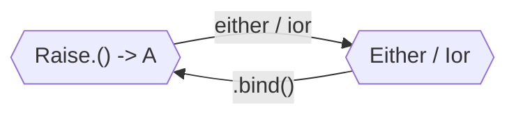

# Either & Ior

Both [`Either<E, A>`](https://arrow-kt.io/docs/apidocs/arrow-core/arrow.core/-either/index.html)
and [`Ior<E, A>`](https://arrow-kt.io/docs/apidocs/arrow-core/arrow.core/-ior/index.html)
hold values which may be of type `E` or `A`.
By convention the type `E` represents _errors_ and the type `A` represents
_success_. For example, `Either<DbError, User>` could be a good result type for
a function which accesses a database and returns a `User`, but may also fail
with a `DbError`. Another point of view is that both types _extend_ the capabilities
of the built-in [`Result`](https://kotlinlang.org/api/latest/jvm/stdlib/kotlin/-result/) 
type, but no longer constraining the potential errors to be `Throwable`.

`Either<E, A>` only admits these two possibilities, a `Left` holding a value of
type `E` or a `Right` holding a value of type `A`. On the other hand, `Ior<E, A>`
provides a third option, namely `Both`. Using `Both` you can represent states 
which are considered successful, but with some potential errors during execution;
like a compiler which finishes successfully but has some warnings. Nevertheless,
`Ior` is not used very often.

## Using builders

The preferred way to work with `Either` and `Ior` is to using [builders](../typed-errors/).
Those start with a call to `either` or `ior` followed by a lambda; inside that
block we can access the uniform typed errors API with functions like `raise`,
`ensure`, and `recover`.

```kotlin
data class MyError(val message: String)

fun isPositive(i: Int): Either<MyError, Int> = either {
  ensure(i > 0) { MyError("$i is not positive") }
  i
}
```

To give you the complete picture, inside those blocks the potential errors are
represented by a receiver of type `Raise<E>`. Functions with that receiver can
be transformed into a variety of types; not only `Either` and `Ior`, but also
`Result`, `Option`, or a nullable type.

A common scenario is to have an `Either` or `Ior` value which we want to execute
as part of the block. That is, we want potential errors in those values to bubble
as errors of the entire block, or keep the execution if the value represents
success. In those cases we need to call `.bind()` over the value of type `Either`
or `Ior`.



## Without builders

Constructors like `.left()` and `.right()`

## Validated
